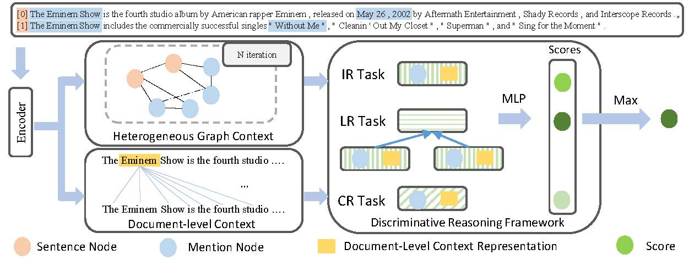

# Discriminative Reasoning for Document-level Relation Extraction
PyTorch implementation for ACL 2021 Findings paper: [Discriminative Reasoning for Document-level Relation Extraction](https://arxiv.org/abs/2106.01562)

> Document-level relation extraction (DocRE) models generally use graph networks to implicitly model the reasoning skill (i.e., pattern recognition, logical reasoning, coreference reasoning, etc.) related to the relation between one entity pair in a document. In this paper, we propose a novel discriminative reasoning framework to explicitly model the paths of these reasoning skills between each entity pair in this document. Thus, a discriminative reasoning network is designed to estimate the relation probability distribution of different reasoning paths based on the constructed graph and vectorized document contexts for each entity pair, thereby recognizing their relation. Experimental results show that our method outperforms the previous state-of-the-art performance on the large-scale DocRE dataset.

+ Architecture


## 0. Package Description
```
DRN/
├─ code/
    ├── checkpoint/: save model checkpoints
    ├── logs/: save training / evaluation logs
    ├── models/:
        ├── DRN.py: DRN model for GloVe or BERT version
        ├── taskdecompose.py: discriminative reasoning framework
        ├── graph.py: graph neural network module
    ├── config.py: process command arguments
    ├── data.py: define Datasets / Dataloader
    ├── test.py: evaluation code
    ├── train.py: training code
    ├── utils.py: some tools for training / evaluation
    ├── *.sh: training / evaluation shell scripts
├─ data/docred: raw data and preprocessed data about DocRED dataset
    ├── prepro_data/
├─ LICENSE
├─ README.md
```

## 1. Environments

- python         (3.7.9)
- cuda           (10.2)
- Ubuntu-18.0.4  (4.4.0-148-generic)

## 2. Dependencies

- numpy          (1.19.1)
- matplotlib     (3.3.1)
- torch          (1.7.1)
- transformers   (4.1.1)
- scikit-learn   (0.23.2)
- wandb (0.10.12)

## 3. Preparation

### 3.1. Dataset
- Download data from [Google Drive link](https://drive.google.com/drive/folders/1c5-0YwnoJx8NS6CV2f-NoTHR__BdkNqw) shared by DocRED authors

- Put `train_annotated.json`, `dev.json`, `test.json`, `word2id.json`, `ner2id.json`, `rel2id.json`, `vec.npy` into the directory `data/docred/`

- If you want to use other datasets, please first process them to fit the same format as DocRED.

### 3.2. Pre-trained Language Models
The package *transformers* would take some time to download the pretrained model for the first time.

## 4. Training

```bash
>> cd code
>> ./runXXX.sh gpu_id   # like ./run_BERT.sh 2
>> tail -f -n 2000 logs/train_xxx.log
```

## 5. Evaluation

```bash
>> cd code
>> ./evalXXX.sh gpu_id threshold(optional)  # like ./eval_BERT.sh 0 0.5521
>> tail -f -n 2000 logs/test_xxx.log
```

PS: we recommend to use threshold = -1 (which is the default, you can omit this arguments at this time) for dev set, 
the log will print the optimal threshold in dev set, and you can use this optimal value as threshold to evaluate test set.

## 6. Submission to LeadBoard (CodaLab)
- You will get json output file for test set at step 5. 

- And then you can rename it as `result.json` and compress it as `result.zip`. 

- At last,  you can submit the `result.zip` to [CodaLab](https://competitions.codalab.org/competitions/20717#participate-submit_results).

## 7. License

This project is licensed under the MIT License - see the [LICENSE](LICENSE) file for details.

## 8. Citation

Our code is adapted from [GAIN](https://github.com/DreamInvoker/GAIN). Thanks for their good work. If you use this work or code, please kindly cite the following paper:

```bib
@inproceedings{wangx-ACL-2021-drn,
 author = {Wang Xu, Kehai Chen and Tiejun Zhao},
 booktitle = {Findings of The Joint Conference of the 59th Annual Meeting of the Association for Computational Linguistics and the 11th International Joint Conference on Natural Language Processing (ACL 2021 Findings)},
 title = {Discriminative Reasoning for Document-level Relation Extraction},
 year = {2021}
}
```

